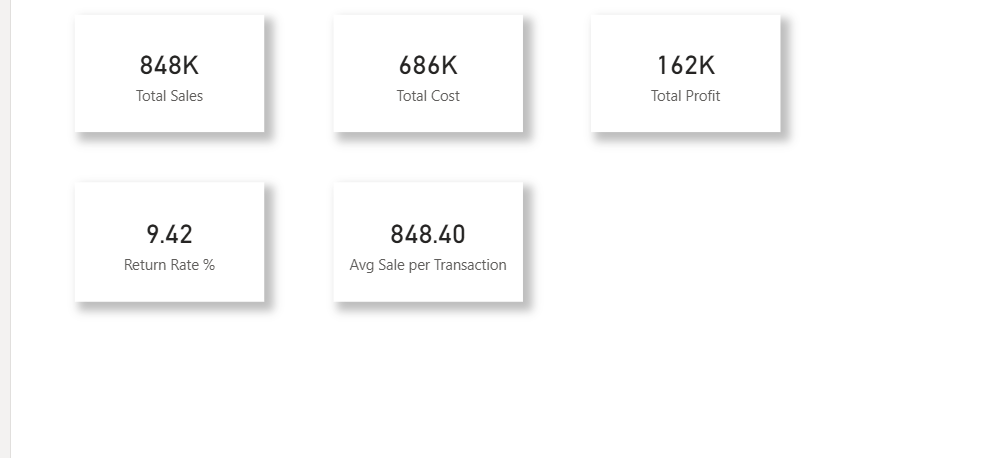
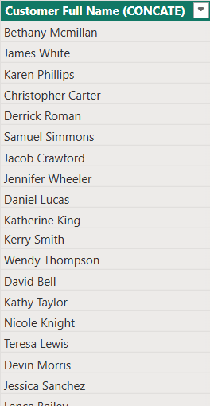
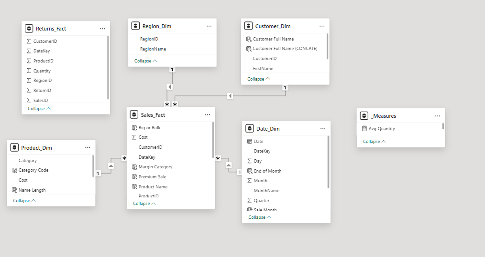

# 📊 DAX Depo – Advanced Calculations Using DAX in Power BI

An advanced Power BI DAX project focused on building calculated columns, measures, filter context behavior, time intelligence, quick measures, and iterator functions — all organized in a structured, multi-tab report layout.

---

## 🚀 Project Overview

This project demonstrates end-to-end DAX (Data Analysis Expressions) inside Microsoft Power BI Desktop. The focus is purely on DAX calculations across multiple categories — no complex visuals, just clean logic verified through Matrix tables and Card visuals.

---

## 📁 Project Files

| File | Description |
|------|-------------|
| 📄 PR_3_DAX_DEPO.pbix | Main Power BI file |
| 📁 files used | Files used in project |
| 📷 Project images | Task screenshots |
| 📘 README.md | Readme of the project |

---

## 📁 Data Sources

| File | Key Columns |
|------|-------------|
| 📊 Sales_Fact | SalesID, CustomerID, ProductID, RegionID, DateKey, SalesAmount, Cost, Quantity |
| 👥 Customer_Dim | CustomerID, FirstName, LastName, Segment |
| 📦 Product_Dim | ProductID, ProductName, Category, Subcategory |
| 🌍 Region_Dim | RegionID, RegionName |
| 📅 Date_Dim | DateKey, Date, Month, Quarter, Year |
| 🔄 Returns_Fact | ReturnID, SalesID, ReturnDateKey, Reason |

---

## 🧩 Project Tasks Breakdown

### 🔹 1️⃣ Calculated Columns

- **Profit**
- **ReturnFlag**
- **Customer Full Name**

```dax
Profit = Sales_Fact[SalesAmount] - Sales_Fact[Cost]

ReturnFlag = IF(
    COUNTROWS( FILTER( Returns_Fact, Returns_Fact[SalesID] = Sales_Fact[SalesID] ) ) > 0,
    "Returned", "Not Returned"
)

Customer Full Name = Customer_Dim[FirstName] & " " & Customer_Dim[LastName]
```

.png)

.png)

---

### 🔹 2️⃣ Measures

- **Total Sales** – Sum of all sales amounts
- **Return Rate** – Percentage of transactions that were returned
- **Total Profit** – Sum of profit across all rows
- **Total Cost** – Sum of cost across all rows
- **Average Sales per Transaction** – Mean sale value per row



---

### 🔹 3️⃣ Quick Measures

- **Year-Over-Year Sales Growth**
- **Difference between Current and Previous Month Sales**


---

### 🔹 4️⃣ Measures Management

In these we have made a table named **Measures Table**.  
We have transferred all measures into a separate table.


---

### 🔹 5️⃣ Filter Context & Behavior

- **North Region Sales** – Uses `CALCULATE` + `FILTER`
- **Sales % of Total** – Uses `ALL()`
- **Total Sales All Regions** – Uses `ALL()`

```dax
North Region Sales = CALCULATE(
    [Total Sales],
    FILTER(Region_Dim, Region_Dim[RegionName] = "North")
)

Sales % of Total = DIVIDE(
    [Total Sales],
    CALCULATE([Total Sales], ALL(Region_Dim)),
    0
) * 100

Total Sales All Regions = CALCULATE( [Total Sales], ALL(Region_Dim) )
```


---

### 🔹 6️⃣ DAX Operators and Functions


**Measures:**

```dax
Total Quantity Sold = SUM(Sales_Fact[Quantity])
Avg Quantity       = AVERAGE(Sales_Fact[Quantity])
Max Sale           = MAX(Sales_Fact[SalesAmount])
Unique Customers   = DISTINCTCOUNT(Sales_Fact[CustomerID])
Transaction Count  = COUNTROWS(Sales_Fact)
```

**Calculated Columns:**

```dax
Profit Tier  = IF( Sales_Fact[SalesAmount] - Sales_Fact[Cost] > 300, "High Profit", "Low Profit" )

Premium Sale = IF( AND(Sales_Fact[SalesAmount] > 2000, Sales_Fact[Quantity] > 4), "Premium", "Standard" )

Big or Bulk  = IF( OR(Sales_Fact[SalesAmount] > 1500, Sales_Fact[Quantity] > 8), "Notable Sale", "Regular" )

Sales Category = SWITCH(
    TRUE(),
    Sales_Fact[SalesAmount] < 500, "Low",
    Sales_Fact[SalesAmount] >= 500 && Sales_Fact[SalesAmount] < 1500, "Medium",
    Sales_Fact[SalesAmount] >= 1500, "High",
    "Other"
)
```


**Columns in Product_Dim & Date_Dim:**

```dax
Customer Full Name (CONCAT) = CONCATENATE(Customer_Dim[FirstName], " " & Customer_Dim[LastName])
Product Label  = UPPER(Product_Dim[Category])
Category Code  = LEFT(Product_Dim[Category], 3)
Sale Year      = YEAR(Date_Dim[Date])
Sale Month     = MONTH(Date_Dim[Date])
End of Month   = EOMONTH(Date_Dim[Date], 0)
```




---

### 🔹 7️⃣ Joining and Relationships

```dax
Product Name = RELATED(Product_Dim[ProductName])
```




---

### 🔹 8️⃣ Time Intelligence (Matrix-based Analysis)

- **`TOTALYTD()`** – Cumulative total from the start of the year to the current date
- **`SAMEPERIODLASTYEAR()`** – Returns the same time period from the previous year for YoY comparison
- **`DATESINPERIOD()`** – Defines a custom rolling date window (e.g., last 30 days, last 3 months)


---

### 🔹 9️⃣ Additional Scenarios

```dax
Margin Category = SWITCH(
    TRUE(),
    (Sales_Fact[SalesAmount] - Sales_Fact[Cost]) < 100, "Low Margin",
    (Sales_Fact[SalesAmount] - Sales_Fact[Cost]) < 300, "Medium Margin",
    (Sales_Fact[SalesAmount] - Sales_Fact[Cost]) < 800, "High Margin",
    "Super Margin"
)

TotalRevenue   = SUMX( Sales_Fact, Sales_Fact[Quantity] * Sales_Fact[Cost] )
AvgOrderValue  = AVERAGEX( Sales_Fact, Sales_Fact[Quantity] * Sales_Fact[Cost] )
```


.png)

---

### 🔹 🔟 Output Requirement


---

## 🛠️ Tools & Technologies Used

| Tool | Features Used |
|------|---------------|
| Power BI Desktop | Report View, Table View, Model View |
| DAX | Calculated Columns, Measures, Iterator Functions, Time Intelligence |
| Power Query | Data import, type casting, blank row removal |
| Fields Pane | Measure table organization |

---

## 📊 Report Tab Structure

| Tab | Content |
|-----|---------|
| Measure | Total Sales, Return Rate %, Total Profit, Total Cost, Avg Sale per Transaction |
| Filter Context & Behaviour | Sales by Region with ALL(), FILTER(), CALCULATE() |
| DAX Operators | Total Quantity Sold, Transaction Count, Max Sale, Unique Customers, Avg Quantity |
| Quick Measure | MoM%, YoY Growth %, Sales % of Total |
| Time Intelligence | Sales YTD, Sales Last Year, Sales Last 3 Months, Running Total |
| Additional | TotalRevenue (SUMX), AvgOrderValue (AVERAGEX) |

---

## 📈 How to Use

1. Download the repository
2. Open `DAX_DEPO.pbix` in **Microsoft Power BI Desktop**
3. Navigate across report tabs to explore each DAX category
4. Go to **Table View** to inspect calculated columns row by row
5. Open the **Fields Pane** to browse the `_Measures` table

---

## 👩‍💻 Priya Savaliya
📍 Ahmedabad

---

⭐ **If You Like This Project** — give this repository a ⭐ and feel free to fork or contribute!

> 🗂️ *Clean DAX. Clear Context. Confident Insights.*
